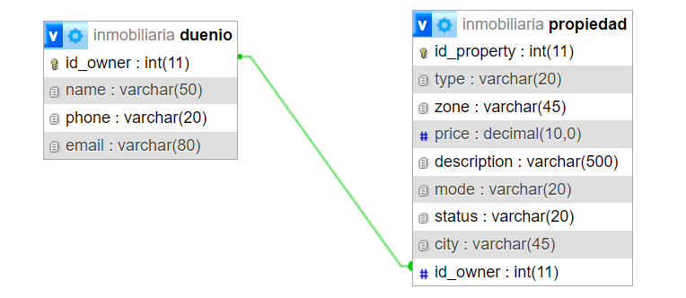
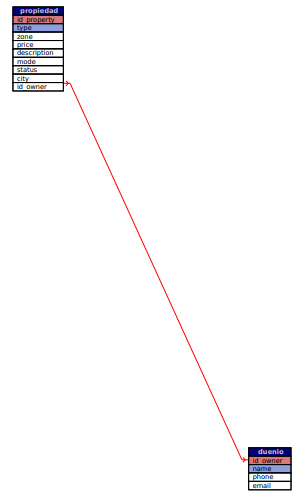

# Trabajo Práctico Especial - WEB 2 - TUDAI - UNICEN - Parte 2

Este proyecto consiste en la continuación del desarrollo de un sitio web dinámico para la gestión y visualización de propiedades inmobiliarias, basado en el modelo de datos propuesto en la **Parte 1**. Se implementaron nuevas funcionalidades y una sección privada para administrar los datos.

## Funcionalidades

### Acceso Público

- **Listado de Propiedades**: Los usuarios pueden ver todas las propiedades cargadas en la base de datos.
- **Detalle de Propiedad**: Los usuarios pueden acceder a la información detallada de una propiedad específica.
- **Listado de Dueños**: Los usuarios pueden visualizar todos los dueños registrados.
- **Listado de Propiedades por Dueño**: Los usuarios pueden filtrar las propiedades por cada dueño.

### Acceso Administrador

- **Autenticación**: Los administradores deben loguearse para acceder a las funcionalidades de administración de datos.
- **Administración de Propiedades**: Los administradores pueden agregar, editar y eliminar propiedades. Cada propiedad debe estar asociada a un dueño.
- **Administración de Dueños**: Los administradores pueden agregar, editar y eliminar dueños.
- **Cerrar Sesión**: Los administradores pueden desloguearse del sistema.

## Requerimientos Técnicos

- El sistema está basado en el patrón **MVC** para separar la lógica del negocio, las vistas y el acceso a los datos.
- Las vistas son generadas utilizando plantillas **PHTML**.
- El sitio utiliza **URL semánticas**.
- La base de datos se inicializa automáticamente si no existe, y se llenará con datos iniciales.
- La autenticación de usuarios utiliza contraseñas encriptadas con el algoritmo password hash.

## Modelo de Datos

El modelo de datos sigue la estructura definida en la primera parte con las siguientes tablas:

### Atributos de la tabla `duenio`:
- `id_owner`: `int(11)` (Primary key)
- `name`: `varchar(50)`
- `phone`: `varchar(20)`
- `email`: `varchar(80)` (único)

### Atributos de la tabla `propiedad`:
- `id_property`: `int(11)` (Primary key)
- `type`: `varchar(20)`
- `zone`: `varchar(45)`
- `price`: `decimal(10,0)`
- `description`: `varchar(500)`
- `mode`: `varchar(20)`
- `status`: `varchar(20)`
- `city`: `varchar(45)`
- `id_owner`: `int(11)` (Foreign key que referencia a la tabla `duenio`)

### Atributos de la tabla `users`:
- `username`: `varchar(20)` (Primary key)
- `password`: `varchar(60)`
- `id_user`: `int(11)` (Auto-increment)

### Requerimientos Funcionales:

## Modelo de Datos

Las entidades principales de la base de datos son **propiedades** y **dueños**. Para cada una se construyó una tabla con sus respectivos atributos. 

- **Tabla propiedades**: Contiene información sobre las propiedades inmobiliarias.
- **Tabla dueños**: Almacena información sobre los dueños de las propiedades.

La relación entre estas tablas es de **1 a N**, lo que significa que un dueño puede tener múltiples propiedades, pero una propiedad sólo puede pertenecer a un dueño.

## Diagrama de Datos

## Instalación y Configuración

1. **Importar la base de datos**:
   Importar el archivo `inmobiliaria.sql` en PHPMyAdmin para cargar la estructura y datos iniciales.

# Usuario admin
username: `webadmin`
password: `admin`

# ruta: 
http://localhost/inmobiliaria/ 

## Agradecimientos

Queremos agradecer a los docentes y ayudantes de la cátedra, así como a la universidad pública por su apoyo.

## Integrantes

- [Diego Santellán](https://www.linkedin.com/in/diego-santellan/)
- [Lis Medina](https://www.linkedin.com/in/lis-medina/)

